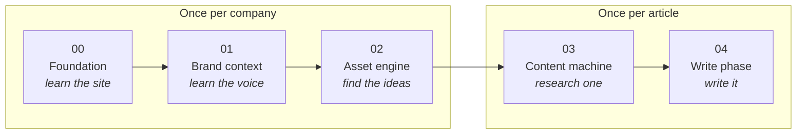
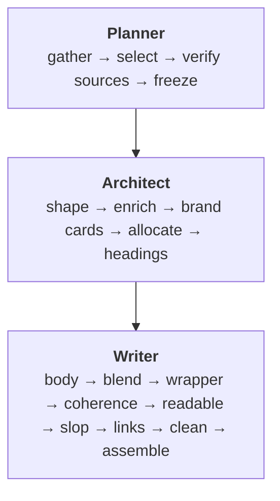
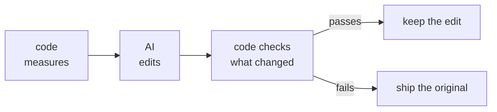

# SEO by Devansh

**A factory line that earns backlinks.** Point it at a company's website. It learns the site,
learns how the company writes, works out what is worth writing about, researches one topic
properly, and writes the article. Every fact it uses carries a word-for-word quote and a live
URL, and a separate step opens that URL to check the number is really on the page.

**The six finished articles are live here:** https://devanshindian.github.io/testlify-articles-0c27c5a4/

---

## The one idea

A company wants other sites to link to it, because search engines still treat a link as a vote.
Buying links is risky and asking for them does not scale. The only durable answer is publishing
something good enough that people choose to link to it.

This is not one clever model doing all of that. It is a line of numbered stations. Each station
is a folder, each has one command, and each writes named files to disk. The next station reads
those files by name. Nothing is passed in memory, so a crash resumes where it stopped and any
number in the finished article can be walked back to the step that produced it.



---

## The five layers

| Layer | What it does | Runs |
|---|---|---|
| **`00-foundation`** | Catalogues every page the site has and what each one ranks for | Once per company |
| **`01-brand-context`** | Learns the brand: facts, voice, style, product, reader, writer brief | Once per company |
| **`02-asset-engine`** | Finds ideas worth building. Three independent methods, merged, then checked against what the site already owns | Once per company |
| **`03-content-machine`** | Turns one chosen idea into a write-ready evidence bundle | Once per article |
| **`04-write-phase`** | Plans, designs and writes the article, then checks it a dozen ways | Once per article |

### What is inside each layer

<details>
<summary><b>00 Foundation</b> — the site catalogue</summary>

`1-site-catalogue` asks the site about itself through several independent sources rather than
trusting any one of them, then extracts the text down a ladder of fallbacks so a page never comes
back silently blank. Junk is removed by repetition: anything appearing on most pages is site
furniture, not content.

Three gates run at the end, and any failure stops the line. Completeness, truncation, and
coverage checked per content type separately, because one type collapsing to zero is invisible
inside a healthy average.
</details>

<details>
<summary><b>01 Brand context</b> — ten builders</summary>

| Engine | Produces |
|---|---|
| `0-brand-facts` | What the company is and does |
| `1-brand-voice` | The yardstick everything else is judged against |
| `2-style-guide` | Style and mechanics |
| `3-features` | Product facts |
| `4-writing-examples` | Real articles, pasted in full and annotated |
| `5-persona` | Who the reader is |
| `6-voices` | Author voices, filled in by the team rather than the machine |
| `7-writer-brief` | The compressed brief the writer actually reads |
| `8-brand-cards` | Product claims the writer may use, as cards |
| `9-field-sources` | Where first-hand material comes from |
</details>

<details>
<summary><b>02 Asset engine</b> — three ways to find an idea</summary>

- **`1-competitor-study`** looks at what already earns links in this market. It copies the
  *format* that worked, never the topic, and ranks on follow links only, because a link magnet
  can turn out to be almost entirely `nofollow`.
- **`2-model-other-niches`** imports formats proven in unrelated industries that nobody here has
  built yet. Higher novelty, lower certainty, no paid calls.
- **`3-study-trends`** reads what people actually argue about. The unit is a *tension*, one
  sentence stating the conflict, never a topic label.
- **`4-merge`** combines them. The same idea found twice is a stronger bet, not a duplicate.
- **`5-reuse-check`** asks whether the site already covers this, and answers with one of: already
  have it, improve the existing page, build from parts, or genuinely new.
</details>

<details>
<summary><b>03 Content machine</b> — research one topic</summary>

| Engine | What it does |
|---|---|
| `10-dataforseo` | Keyword and competitor data. Free filters first, pay only for the shortlist |
| `11-storm` | The deep research run. Several researchers ask questions, one expert answers with sources |
| `12-gap-check` | Did the research cover what the brief says matters? Misses trigger follow-up runs |
| `13-research-structure` | Who the researchers are, and reattaching every claim to its source |
| `14-research-conductor` | The world statement, the topic gate, and the spine |

Two ideas do the heavy lifting here. The **world statement** is written before any money is
spent, and it says explicitly what the topic *is not*. The **topic gate** sits after the search
data exists but before the expensive research, and deliberately does not see the content gaps,
because showing a judge a list of openings nobody has taken talks it into "worth doing".
</details>

<details>
<summary><b>04 Write phase</b> — plan, design, write</summary>



**Planner.** Gathers everything, tags each sub-heading, then code does the arithmetic on the
tags so nothing is cut on opinion. Then it verifies sources: code finds every claim carrying a
number, a model decides which need proof, and the step opens the cited page to check the number
is really there. The plan is frozen after this and never changes.

**Architect.** Every approved sub-heading becomes a numbered box. The model may merge, split,
reorder, nest or drop boxes, but may only write back headings and box numbers. A number cannot
be paraphrased, so evidence follows it automatically and placement becomes auditable in code.

**Writer.** Nine steps. Each section sees only its own facts but every other section's plan, so
parallel calls still pull in one direction. `clean` is pure code and runs last.
</details>

---

## The three rules it is built on

**Code counts, AI judges.** If a thing can be counted, a script counts it. If two sensible people
could disagree, the model decides. Nothing arguable goes to a script, and nothing countable goes
to a model.

**Nothing is invented.** Every fact carries an ID, a word-for-word quote and a live URL. A
separate step whose only job is checking opens that URL and confirms the number is on the page.
It is the most expensive step in the system, and the right place for the budget.

**Every step writes a named file.** So a crash resumes, every number traces back to the step that
made it, and you can open the state at any point in the line.

### The guard pattern

It shows up at every stage where a model edits something:



An automated edit can fail to improve something. It can never damage it.

---

## Repo layout

```
Backlink gets Automated/
  workflows/                 the pipeline. Company-agnostic, all the code
    00-foundation/ 01-brand-context/ 02-asset-engine/
    03-content-machine/ 04-write-phase/
    SKILL.md                 the start-here index: every engine and its run order
    FOUNDER-WALKTHROUGH.md   the whole pipeline explained out loud, two points per step
  projects/testlify/         one worked example company
pillar-cluster-strategy/     the pillar and cluster content strategy
```

Every engine folder has the same shape, so learning one teaches you all of them:

```
<engine>/
  <engine>-plan.md     the recipe: the steps, in order
  README.md            how to run it, and the file map
  scripts/
    config.py          every path and setting, from one anchor
    llm.py             the only place a model gets called
    <step>.py          one per step. Its docstring says "Reads: X. Writes: Y"
  prompts/
    <call>.md          one file per model call. Never inlined in code
```

---

## The three commands

They live in `.claude/commands/` and run as slash commands in Claude Code.

| Command | What it does |
|---|---|
| **`/research [claude\|codex] [model]`** | Researches the next topic in the queue and stops. Pick → DataForSEO → STORM → gap check → structure → bundle → log |
| **`/writer <slug>`** | Writes a topic that is already researched: planner → architect → field → writer. The one you reach for most, because research happens once per topic and writing gets re-run every time a prompt changes |
| **`/article [topic]`** | Both halves for exactly one topic, then stops. It does not roll on to the next one, so a topic is either finished or in progress, never a pile of half-done ones |

A topic with no real keyword demand is marked skipped with a remark and the run moves on, so it
never stalls the queue. Every command is resumable: each step writes its output file, and a
re-run reuses what is already there.

---

## Running it

You need Python, a DataForSEO account for the search data, and a model to call. Every model call
goes through a command-line tool that is already logged in, so there is no AI API key anywhere in
the repo.

Credentials live in a git-ignored `.env` at the repo root. Nothing else reads them.

```bash
DFS_LOGIN=your-login
DFS_PW=your-password
```

---

## What is deliberately not in here

The pipeline and one worked example, not the machine's exhaust. Left out on purpose: the raw
page cache and full site catalogue, run logs, the usage and cost ledger, and the standing
internal notes on what the machine still gets wrong.
