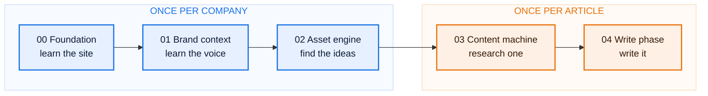
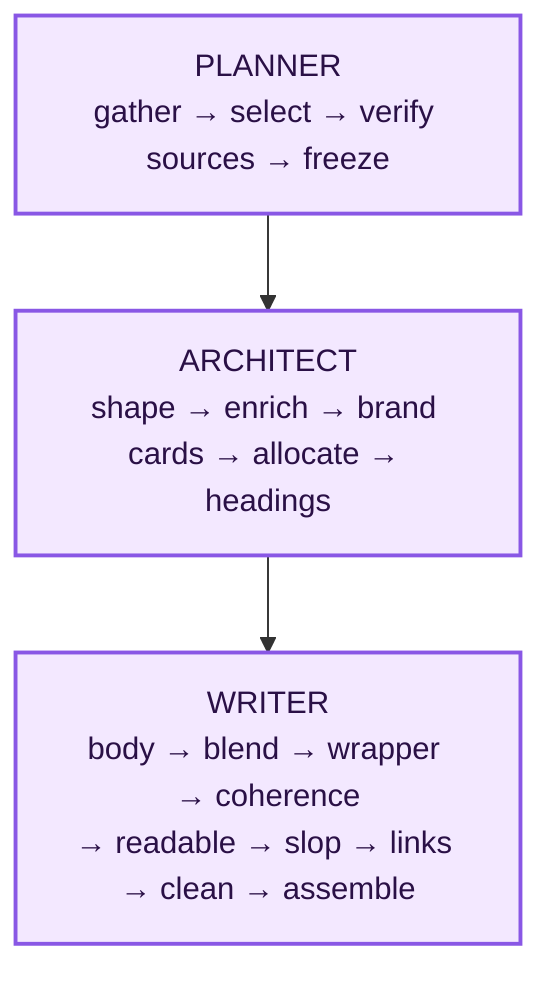
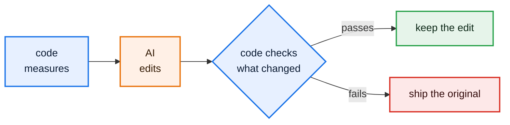

<h1 align="center">SEO by Devansh</h1>

<p align="center"><b>A factory line that earns backlinks.</b></p>

<p align="center">
  
  
  
  
  
</p>

<p align="center">
  <a href="https://devanshindian.github.io/testlify-articles-0c27c5a4/"><b>See the six finished articles →</b></a>
</p>

---

Point it at a company's website. It learns the site, learns how the company writes, works out
what is worth writing about, researches one topic properly, and writes the article. Every fact
it uses carries a word-for-word quote and a live URL, and a separate step opens that URL to
check the number is really on the page.

## The one idea

A company wants other sites to link to it, because search engines still treat a link as a vote.
Buying links is risky and asking for them does not scale. The only durable answer is publishing
something good enough that people choose to link to it.

This is not one clever model doing all of that. It is a line of numbered stations. Each station
is a folder, each has one command, and each writes named files to disk. The next station reads
those files by name. Nothing is passed in memory, so a crash resumes where it stopped and any
number in the finished article can be walked back to the step that produced it.



---

## The three commands

They live in `.claude/commands/` and run as slash commands in Claude Code.

| Command | What it does |
|---|---|
| **`/research [claude\|codex] [model]`** | Researches the next topic in the queue and stops. Pick, keyword data, deep research, gap check, structure, bundle, log |
| **`/writer <slug>`** | Writes a topic that is already researched: planner, architect, field, writer. The one you reach for most, because research happens once per topic and writing gets re-run every time a prompt changes |
| **`/article [topic]`** | Both halves for exactly one topic, then stops. It does not roll on to the next one, so a topic is either finished or in progress, never a pile of half-done ones |

> [!TIP]
> Every command is resumable. Each step writes its output file, and a re-run reuses what is
> already there. A topic with no real keyword demand is marked skipped with a remark and the run
> moves on, so it never stalls the queue.

---

## The five layers

| | Layer | What it does | Runs |
|---|---|---|---|
| 🔵 | **`00-foundation`** | Catalogues every page the site has and what each one ranks for | Once per company |
| 🔵 | **`01-brand-context`** | Learns the brand: facts, voice, style, product, reader, writer brief | Once per company |
| 🔵 | **`02-asset-engine`** | Finds ideas worth building. Three methods, merged, then checked against what the site already owns | Once per company |
| 🟠 | **`03-content-machine`** | Turns one chosen idea into a write-ready evidence bundle | Once per article |
| 🟠 | **`04-write-phase`** | Plans, designs and writes the article, then checks it a dozen ways | Once per article |

<br/>

<details>
<summary><h3>🔵 &nbsp;00 Foundation &nbsp;·&nbsp; the site catalogue</h3></summary>

**Ask the site, never assume the site.** It reads the site through several independent sources
rather than trusting any one of them, because each source misses different things, then merges
and dedupes what comes back.

Text extraction runs down a ladder of fallbacks, ending at a real browser for pages that only
render with JavaScript, so a page is never recorded as silently blank. Junk is stripped by
repetition: pull too much on purpose, then delete any line that appears on most pages, because
that is site furniture, not content.

**Three gates run at the end, and any failure stops the line.**

| Gate | Checks |
|---|---|
| Completeness | Pages retrieved plus pages known to have failed must equal the number the source publishes about itself |
| Truncation | Bytes saved against the bytes the response promised |
| Coverage | Measured per content type separately, because one type collapsing to zero is invisible inside a healthy average |

</details>

<details>
<summary><h3>🔵 &nbsp;01 Brand context &nbsp;·&nbsp; ten builders</h3></summary>

| Engine | Produces |
|---|---|
| `0-brand-facts` | What the company is and does |
| `1-brand-voice` | The yardstick everything else is judged against |
| `2-style-guide` | Style and mechanics |
| `3-features` | Product facts |
| `4-writing-examples` | Real articles, pasted in full and annotated |
| `5-persona` | Who the reader is |
| `6-voices` | Author voices, filled in by the team rather than the machine |
| `7-writer-brief` | The compressed brief the writer actually reads |
| `8-brand-cards` | Product claims the writer may use, as cards |
| `9-field-sources` | Where first-hand material comes from |

> [!NOTE]
> The pages it learns voice from are not simply the highest-traffic ones. Commercial pages go in
> deliberately even at zero traffic, because voice matters most where the selling happens.

</details>

<details>
<summary><h3>🔵 &nbsp;02 Asset engine &nbsp;·&nbsp; three ways to find an idea</h3></summary>

**Competitor study.** Looks at what already earns links in this market. It copies the *format*
that worked, never the topic, and ranks on follow links only, because an apparent link magnet can
turn out to be almost entirely `nofollow`. The tool's competitor list is a starting point, not an
answer, so a human approves it.

**Other niches.** Imports formats proven in unrelated industries that nobody here has built.
Higher novelty, lower certainty, and no paid calls.

**Trends.** Reads what people actually argue about. The unit is a *tension*, one sentence stating
the conflict, never a topic label, because a topic label is not an idea.

**The merge.** The same idea found twice is a stronger bet, not a duplicate. The filter that
trims the pool judges one idea at a time, never drops something for having few links, and
refuses to apply itself at all if it wants to cut more than a small share of the pool.

**The reuse check.** Asks whether the site already covers this, and answers with one of: already
have it, improve the existing page, build from parts, or genuinely new.

> [!IMPORTANT]
> The judge never sees the similarity scores, and any URL that was not in that idea's own
> candidate list is dropped in code. An invented URL cannot survive.

</details>

<details open>
<summary><h3>🟠 &nbsp;03 Content machine &nbsp;·&nbsp; how research works</h3></summary>

This is the layer that decides whether an article is worth writing **before** any real money is
spent on it.

**1. The world statement comes first.** One paragraph saying what this topic is, and explicitly
what it is *not*. Something like "hiring hackathons run by an employer, not public prize
hackathons or charity events." Every later step reads it, which is what keeps a research run from
wandering into an adjacent subject that merely shares a word.

**2. Keyword research pays late.** Free filters run first on volume and difficulty. Only the
shortlist costs anything. One primary keyword is picked, the live results page is read, and the
headings from the top results are pulled so the plan knows what the field already covers.

**3. The topic gate sits between the two.** It runs after the search data exists but before the
expensive research, and it is two calls in order.

> [!WARNING]
> The first call, *is this our reader?*, deliberately does not see the content gaps. Showing a
> judge a list of openings nobody has taken talks it into "worth doing" every single time. Only
> if the answer is yes does the second call run: *what is the real angle here now?*

A cannibalisation flag warns if the site already ranks for this. It never blocks.

**4. The spine.** One paragraph on what this specific article argues. Everything downstream is
filtered against it.

**5. Then the deep research.** A panel of researchers interviews a single expert. The researchers
ask questions from fixed points of view and only the expert can search, so every answer comes
back attached to sources. The four viewpoints are mandated rather than chosen by the machine:

| Researcher | Asks about |
|---|---|
| 🔨 **Builder** | The methods. How is this actually done |
| 🤨 **Sceptic** | Cost, failure, and who it disadvantages |
| 📐 **Evidence** | Does it work, and how would anyone know |
| 🧰 **Practitioner** | The awkward questions a polished guide skips |

Letting the machine staff its own panel is how a public-events organiser once ended up being
interviewed for an article about hiring. Fixing the four viewpoints fixed that.

**6. A gap check** reads the result against the brief. Anything the brief says matters but the
research missed becomes a follow-up run, capped at three. The cap is deliberate: scarcity forces
the follow-ups onto the article's actual angle instead of trivia.

**7. The blueprint** turns everything into cards.

```
id            a stable handle
gloss         one line. The only field the grouping step may read
verbatim      the exact source text, word for word
source_urls   where it came from
tag           what kind of evidence it is
```

Cards are pruned **before** they are grouped, never after, because good evidence hides inside
off-topic sections and pruning by section throws it out with them. A protect rule keeps any card
carrying a number, threshold, statistic or sample, whatever its score.

</details>

<details>
<summary><h3>🟠 &nbsp;04 Write phase &nbsp;·&nbsp; plan, design, write</h3></summary>



**Planner.** Gathers everything, tags each sub-heading, then code does the arithmetic on the tags
so nothing is cut on opinion. Then it verifies sources: code finds every claim carrying a number,
a model decides which of those need proof, and the step opens the cited page to check the number
is really there. The plan is frozen after this and never changes.

**Architect.** Every approved sub-heading becomes a numbered box. The model may merge, split,
reorder, nest or drop boxes, but may only write back headings and box numbers. Word counts are
proposed by the model and then made to total correctly in code.

**Writer.** Nine steps. Each section sees only its own facts but every other section's plan, so
parallel calls still pull in one direction. The product is allowed in the closing section and
nowhere else. `clean` is pure code and runs last, which is what finally killed the em dashes.

</details>

---

## Highlights

<table>
<tr><td width="50%" valign="top">

**🔢 The numbered-box trick**

The architect writes back only headings and integers, so a box title cannot be quietly
paraphrased. An integer either resolves to a card or it does not. The evidence follows the number
automatically, and placement becomes auditable in code: boxes used against boxes available gives
an exact unused list, and a box appearing twice gets flagged.

</td><td width="50%" valign="top">

**🧪 Checking the checks**

One step passed every one of its own thirteen checks on every run while cutting finished articles
by more than half, deleting examples and keeping statistics. Two checks pointed backwards. The
readability gate demanded a score the human articles it was imitating would themselves have
failed, and the real problem, fact density, had nothing measuring it at all.

</td></tr>
<tr><td width="50%" valign="top">

**🕳️ "Nothing found" is not a finding**

When a request comes back empty there are two reasons and they look identical: there is nothing
there, or you were blocked. Three labels get recorded, `empty`, `blocked` and `unknown`, and
`unknown` is never rounded down to `empty`.

</td><td width="50%" valign="top">

**☝️ Decide a value once**

A field that appears as the output of three steps will drift, and then nobody can say which copy
is real. The article's primary keyword is chosen in one step and carried forward, never
re-picked.

</td></tr>
<tr><td width="50%" valign="top">

**💾 Never write a file directly**

Every save writes a temp file in the same directory and renames it over the target. Resume trusts
"the output exists" to mean "the step finished", so a step that dies mid-write would otherwise
leave a half-file that resume happily believes.

</td><td width="50%" valign="top">

**🛡️ The guard pattern**

Code measures, the model edits, then code checks what actually changed. Any guard failure and the
original ships. An automated edit can fail to improve something. It can never damage it.

</td></tr>
</table>



---

## The three rules it is built on

> [!IMPORTANT]
> **Code counts, AI judges.** If a thing can be counted, a script counts it. If two sensible
> people could disagree, the model decides. Nothing arguable goes to a script, and nothing
> countable goes to a model.
>
> **Nothing is invented.** Every fact carries an ID, a word-for-word quote and a live URL. A
> separate step whose only job is checking opens that URL and confirms the number is on the page.
> It is the most expensive step in the system, and the right place for the budget.
>
> **Every step writes a named file.** So a crash resumes, every number traces back to the step
> that made it, and you can open the state at any point in the line.

---

## Running it

You need Python, a DataForSEO account for the search data, and a model to call. Every model call
goes through a command-line tool that is already logged in, so **there is no AI API key anywhere
in the repo.**

Credentials live in a git-ignored `.env` at the repo root. Nothing else reads them.

```bash
DFS_LOGIN=your-login
DFS_PW=your-password
```

<details>
<summary><b>Repo layout, and the shape every engine shares</b></summary>

<br/>

```
Backlink gets Automated/
  workflows/                 the pipeline. Company-agnostic, all the code
    00-foundation/ 01-brand-context/ 02-asset-engine/
    03-content-machine/ 04-write-phase/
    SKILL.md                 the start-here index: every engine and its run order
    FOUNDER-WALKTHROUGH.md   the whole pipeline explained out loud, two points per step
  projects/testlify/         one worked example company
pillar-cluster-strategy/     the pillar and cluster content strategy
.claude/commands/            the three slash commands
```

Learning one engine teaches you the rest, because they all look like this:

```
<engine>/
  <engine>-plan.md      the recipe: the steps, in order
    or <engine>.workflow.md
  README.md             how to run it, and the file map
  scripts/
    config.py           every path and setting, from one anchor
    llm.py              the only place a model gets called
    <step>.py           one per step. Its docstring says "Reads: X. Writes: Y"
  prompts/
    <call>.md           one file per model call. Never inlined in code
```

Across the pipeline that comes to 20 engine READMEs, 20 `config.py` files and 19 `prompts/`
folders. The 14 engines that call a model have an `llm.py`; the ones that only fetch or compute
do not.

</details>

<details>
<summary><b>What is deliberately not in here</b></summary>

<br/>

The pipeline and one worked example, not the machine's exhaust. Left out on purpose: the raw page
cache and full site catalogue, the virtualenvs, run logs, the usage and cost ledger, and the
standing internal notes on what the machine still gets wrong.

</details>
